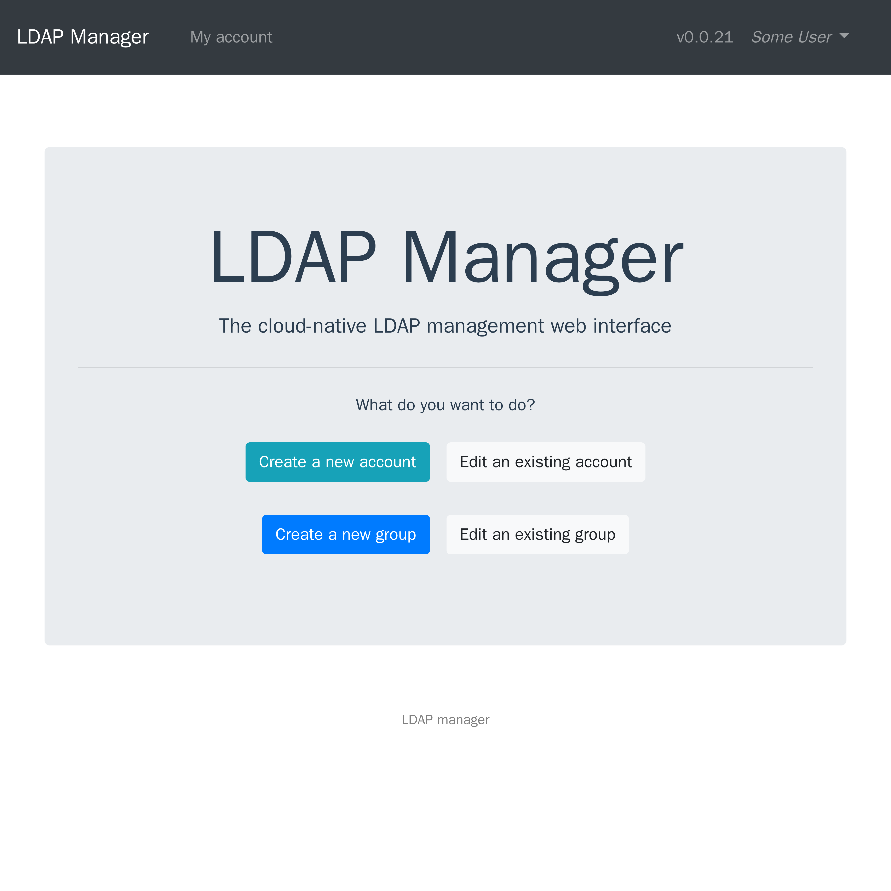
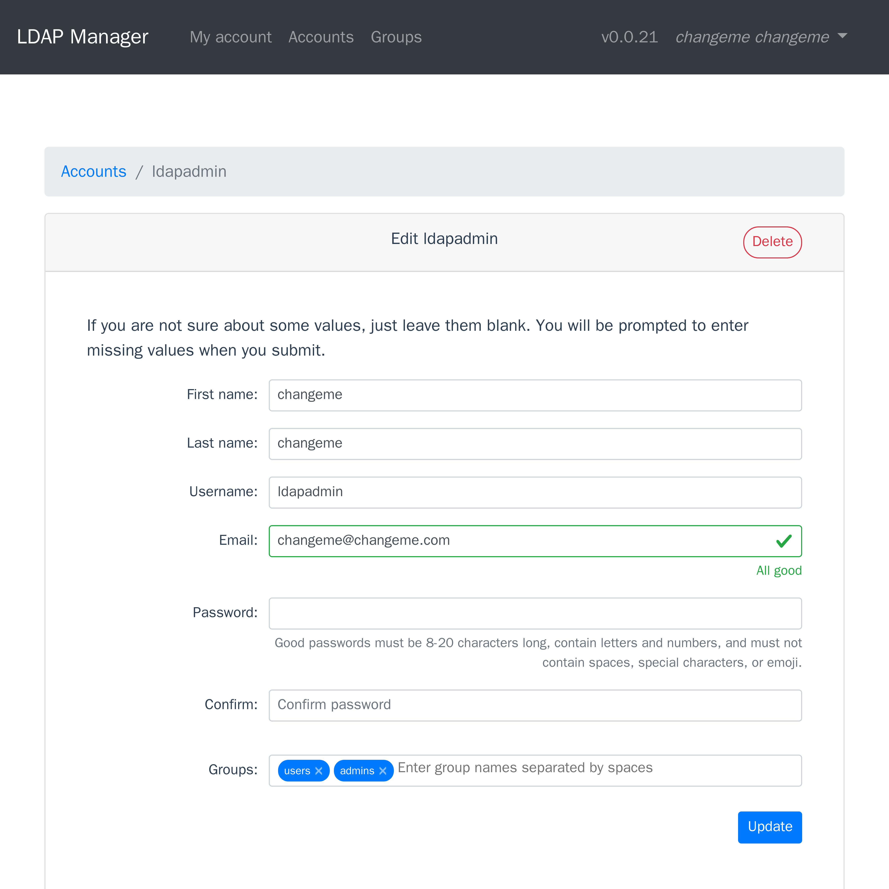
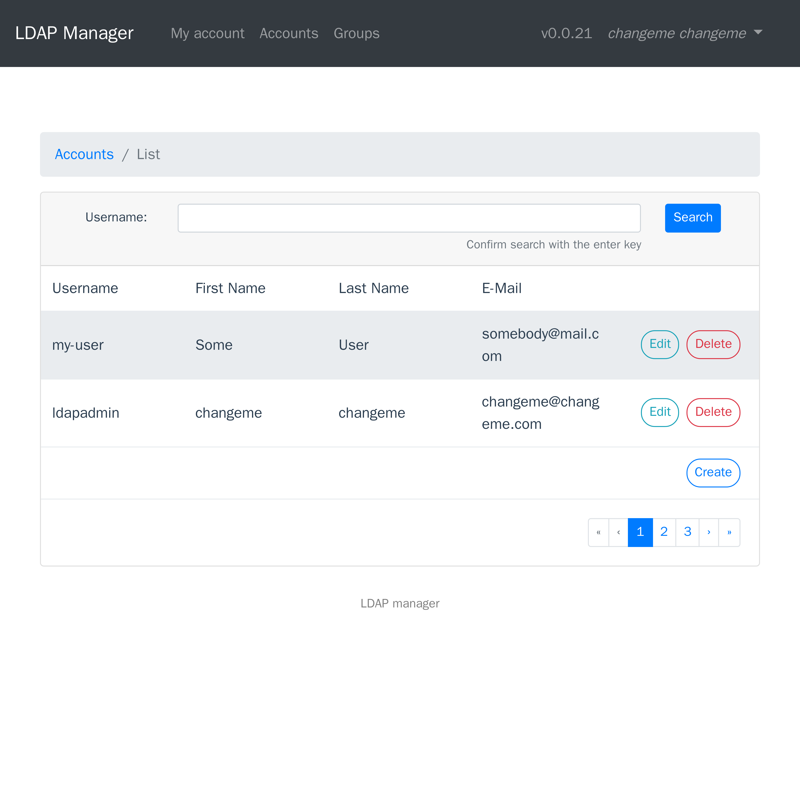
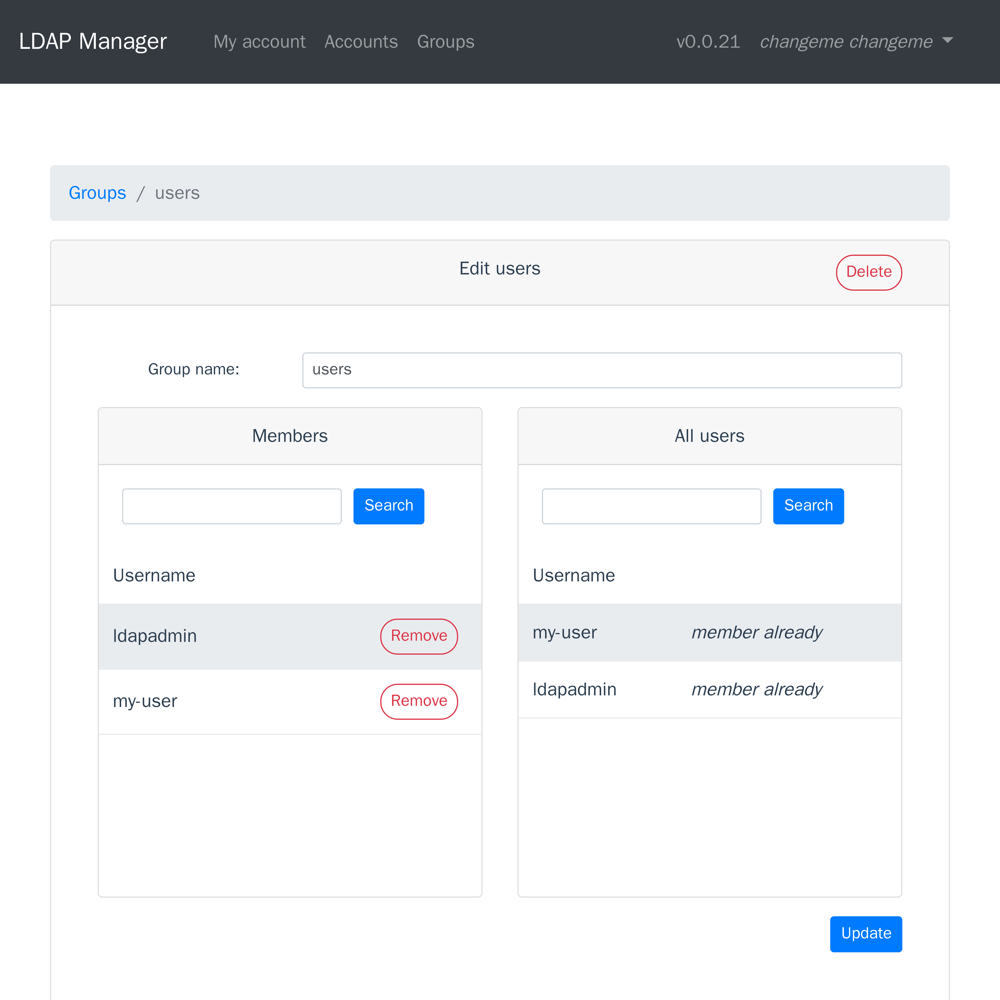

## ldap-manager

[](https://github.com/romnn/ldap-manager/actions)
[](https://github.com/romnn/ldap-manager)
[](https://hub.docker.com/r/romnn/ldap-manager)
[](https://codecov.io/gh/romnn/ldap-manager)
[](https://github.com/romnn/ldap-manager/releases/latest)

<p align="center">
  
</p>

LDAP Manager is the cloud-native LDAP web management interface. LDAP has been around for a long time and has become a popular choice for user and group management - however, this should not mean that it's management interface should be hard to deploy and look and feel like it was made in the last century.

LDAP Manager is written in Go and comes with a Vue/Typescript frontend in a single, self-contained docker container. It also exposes it's API over both REST and gRPC!

|                                                 |                                                 |
| :---------------------------------------------: | :---------------------------------------------: |
|            |  |
|  |    |

Before you get started, make sure you have an OpenLDAP server like
[osixia/openldap](https://hub.docker.com/r/osixia/openldap/) running.
For more information on deployment and a full example,
see the [deployment guide](#Deployment).

```bash
go install github.com/romnn/ldap-manager/cmd/ldap-manager
ldap-manager serve --generate
```

You can also download pre-built binaries from the
[releases page](https://github.com/romnn/ldap-manager/releases),
or use the `docker` image:

```bash
docker run -p 8080:80 -p 9090:9090 romnn/ldap-manager --generate
```

For a list of options, run with `--help`. If you want to deploy OpenLDAP with LDAP Manager, read along.

### Deployment

##### docker-compose

```bash
docker-compose -f deployment/docker-compose.yml up
```

##### Helm

TODO

##### Considerations

- Serving the frontend externally
  If you have a cluster environment and want to scale the `ldap-manager` container individually or use a more performant static content server like `nginx`, you can disable serving static content using the `--no-static` (`NO_STATIC`) flag.

### Development

#### Tools

Before you get started, make sure you have installed the following tools:

```bash
$ python3 -m pip install pre-commit bump2version invoke
$ go install github.com/kyoh86/richgo@latest
$ go install golang.org/x/tools/cmd/goimports@latest
$ go install golang.org/x/lint/golint@latest
$ go install github.com/fzipp/gocyclo/cmd/gocyclo@latest
```

Please always make sure code checks pass:

```bash
inv pre-commit
```

#### Compiling proto sources

If you want to (re-)compile the grpc service and gateway `.proto` source files,
you will need

- `protoc`
- `protoc-gen-go`
- `protoc-gen-go-grpc`.
- `protoc-gen-grpc-gateway`
- `protoc-gen-openapiv2`

```bash
apt install -y protobuf-compiler
brew install protobuf

go install google.golang.org/protobuf/cmd/protoc-gen-go@latest
go install google.golang.org/grpc/cmd/protoc-gen-go-grpc@latest
go install github.com/grpc-ecosystem/grpc-gateway/v2/protoc-gen-grpc-gateway@latest
go install github.com/grpc-ecosystem/grpc-gateway/v2/protoc-gen-openapiv2@latest
```

To compile the protos, you can use the provided script:

```bash
inv compile-proto
```

#### TODO

- v2

  - add integration test with harbor
  - test the grpc and http servers as well
  - refactor to use manual ldap search only where necessary
  - fix the frontend
  - fix the docker container
  - decide what goes into pkg and what goes into internal
  - use an interface for the main functions of the manager in GRPC server
  - fix nil pointer errors
  - point out that the goal is user management only

  - documentation

- nice to have

  - Implement CLI interface
    - new acc
    - change password
    - add group
    - add member to group
    - list users
    - verify?

- done
  - add tests for each file in pkg
  - Implement missing password hashing algorithms
  - Embed crypt(3) as vendored?
  - Fix flaky tests using fuzzy testing and check slappasswd source
  - add pagination
  - get rid of the password hashing mess
  - decide on a consistent naming (user vs account)
  - split into more files
  - update dependencies
  - fix issues and use new api for grpc and http without a base
  - add images to the readme
